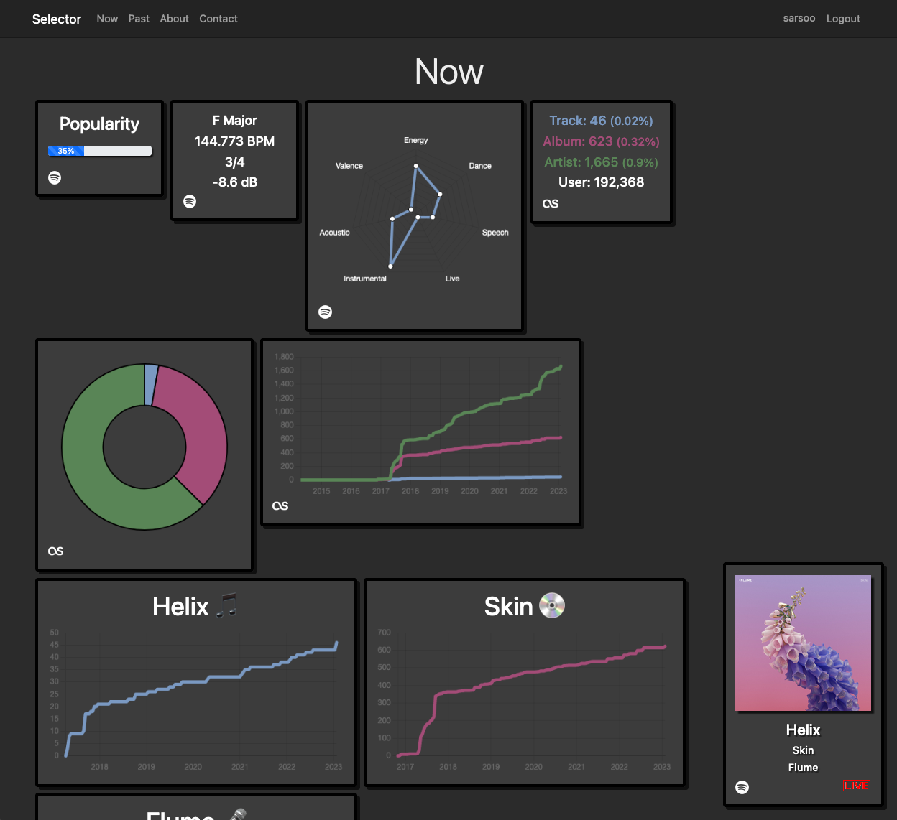

# Selector

Selector is a suite for monitoring and reacting to live changes on a Spotify account. The player watcher keeps an eye on what you're listening to and fires off events when things change. The idea is that various pieces of information will be collated and presented in a now-playing-style dashboard. 

Last.fm play counts will be collected, as will the Spotify audio features.

